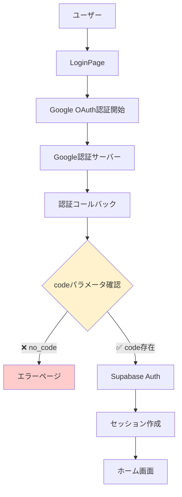
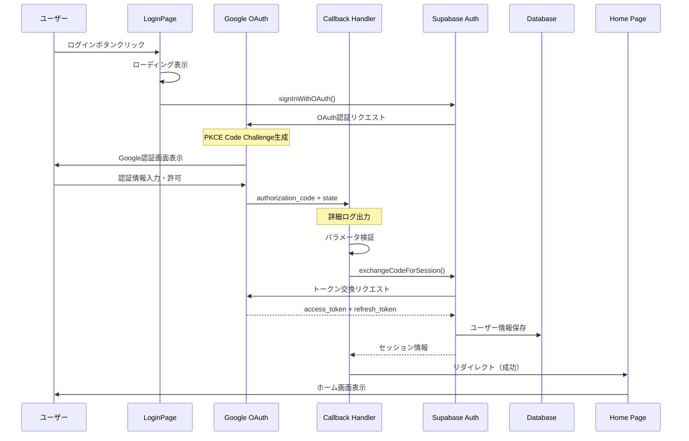
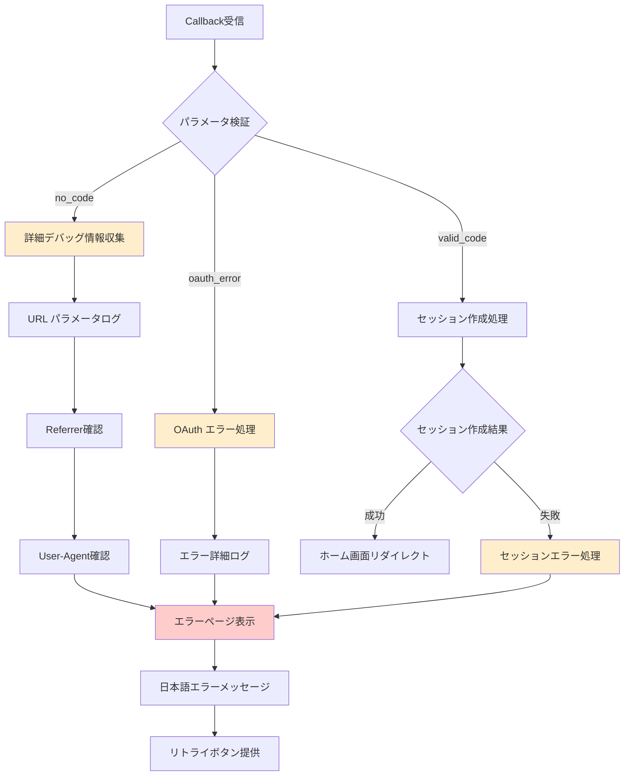
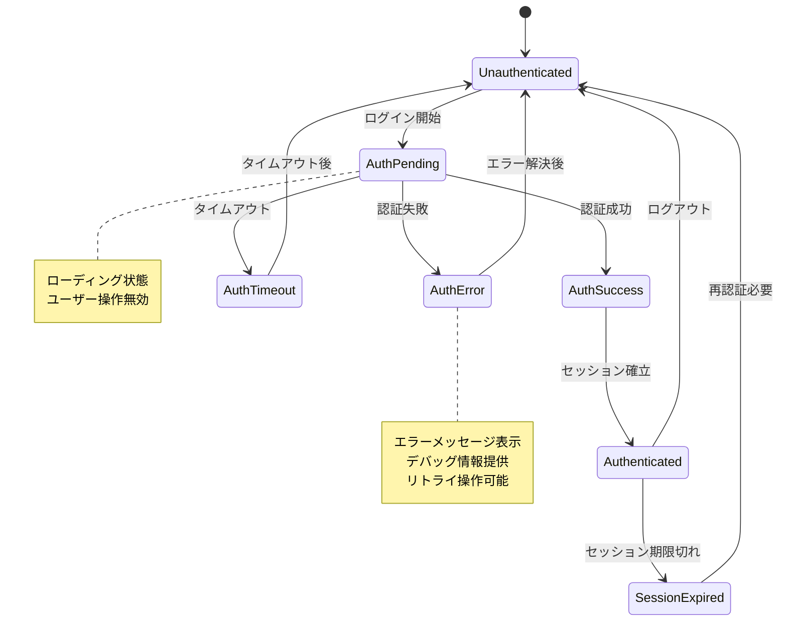
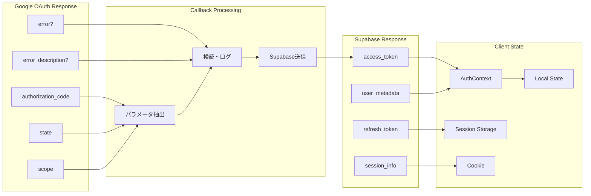
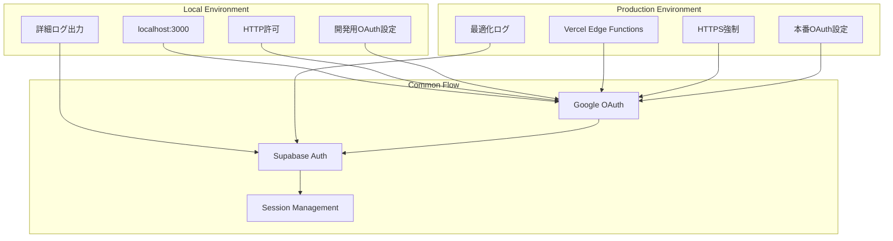
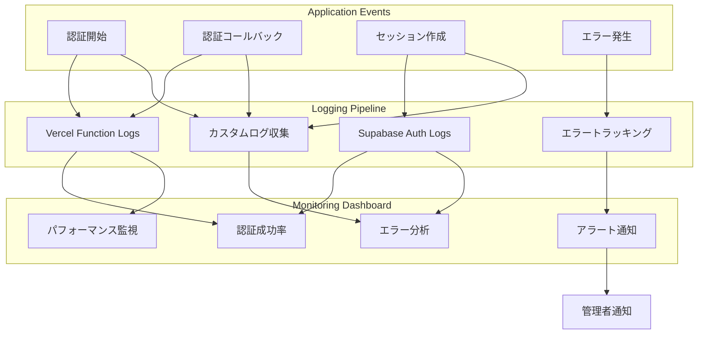
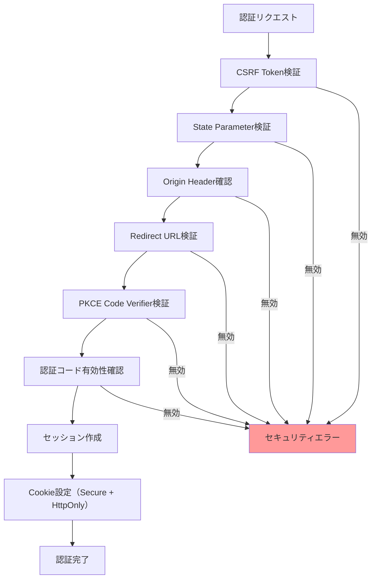

# Google認証修復 データフロー設計

## 認証フローの全体概要

Google OAuth認証における理想的なデータフローと、現在発生している問題点、および修復後の改善されたフローを定義します。

## 現在の問題フロー分析

### 問題のあるフロー（現状）

### 問題発生ポイント

1. **Google → Callback間**: 認証コードの未送信
2. **環境差異**: 本番環境特有の制約
3. **エラーハンドリング**: 不十分なデバッグ情報

## 修復後の理想フロー

### 正常認証フロー

### エラーハンドリングフロー

## 状態管理データフロー

### 認証状態の管理

## データ構造とフロー

### 認証関連データの流れ

## 環境別データフロー

### ローカル環境 vs 本番環境

## リアルタイム監視データフロー

### ログとモニタリング

## セキュリティデータフロー

### セキュリティ検証フロー

## パフォーマンス最適化フロー

### レスポンス時間最適化

```mermaid
gantt
    title 認証処理タイムライン（目標vs現状）
    dateFormat X
    axisFormat %Ls

    section 理想フロー
    ログインボタンクリック    :active, ideal1, 0, 500
    OAuth認証画面表示        :ideal2, after ideal1, 1000
    認証情報入力            :ideal3, after ideal2, 2000
    コールバック処理        :ideal4, after ideal3, 500
    セッション作成          :ideal5, after ideal4, 1000

    section 現状問題フロー
    ログインボタンクリック    :prob1, 0, 500
    OAuth認証画面表示        :prob2, after prob1, 2000
    認証情報入力            :prob3, after prob2, 2000
    エラー発生              :crit, prob4, after prob3, 1000
```

---

**作成者**: システムアーキテクト
**最終更新**: 2025-08-23
**次回レビュー**: 実装完了後
