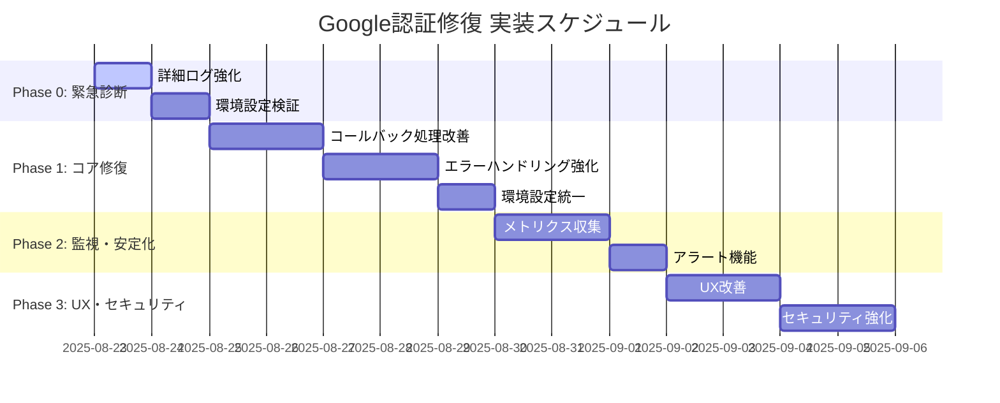

# Google認証修復 実装計画書

## 概要

Google OAuth認証の`no_code`エラー修復のための段階的実装計画。緊急度に応じたフェーズ分けによる効率的な問題解決を目指します。

## 実装フェーズ

### Phase 0: 緊急診断・応急対応（1-2日）

**目標**: 問題の即座特定と一時的な回避策実装

#### 実装項目

1. **詳細ログ強化**
   ```typescript
   // src/app/auth/callback/route.ts での追加ログ
   console.log('=== 緊急デバッグ情報 ===');
   console.log('Full URL:', request.url);
   console.log('All headers:', Object.fromEntries(request.headers.entries()));
   console.log('Environment:', process.env.NODE_ENV);
   console.log('Supabase URL:', process.env.NEXT_PUBLIC_SUPABASE_URL);
   ```

2. **環境設定検証スクリプト**
   ```bash
   # scripts/verify-auth-config.js
   node scripts/verify-auth-config.js
   ```

3. **リアルタイム監視**
   - Vercel Function Logs の確認
   - Supabase Auth Logs の確認
   - ブラウザネットワークタブの分析

#### 成功基準
- 問題の根本原因特定
- 詳細なエラー情報収集
- 回避策の特定（あれば実装）

#### リスク
- 本番環境での調査によるパフォーマンス影響
- ログ出力による機密情報露出リスク

### Phase 1: コア修復（3-5日）

**目標**: 認証フローの根本的修復

#### 実装項目

1. **認証コールバック処理の改善**
   ```typescript
   // src/app/auth/callback/route.ts
   export async function GET(request: Request) {
     try {
       const { searchParams, origin } = new URL(request.url);

       // 詳細パラメータ検証
       const authParams = validateAuthParams(searchParams);

       // 環境別設定の適用
       const config = getEnvironmentConfig();

       // Supabase Auth 処理
       const authResult = await processAuthentication(authParams, config);

       return handleAuthSuccess(authResult, origin);

     } catch (error) {
       return handleAuthError(error, request);
     }
   }
   ```

2. **エラーハンドリング強化**
   ```typescript
   // src/lib/auth-error-handler.ts
   export class AuthErrorHandler {
     static handle(error: AuthError, context: AuthContext): AuthErrorResult {
       // エラータイプ別の処理
       switch (error.type) {
         case 'no_code':
           return this.handleNoCodeError(error, context);
         case 'oauth_error':
           return this.handleOAuthError(error, context);
         default:
           return this.handleUnknownError(error, context);
       }
     }
   }
   ```

3. **環境設定の統一**
   ```typescript
   // src/config/auth.ts
   export const authConfig = {
     development: {
       redirectUri: 'http://localhost:3000/auth/callback',
       siteUrl: 'http://localhost:3000'
     },
     production: {
       redirectUri: 'https://social-media-app-jade-three.vercel.app/auth/callback',
       siteUrl: 'https://social-media-app-jade-three.vercel.app'
     }
   };
   ```

#### 成功基準
- Google認証の成功率 95%以上
- エラー時の適切なメッセージ表示
- 本番・開発環境での動作統一

#### リスク
- 既存ユーザーのセッション無効化
- 認証フロー変更による他機能への影響

### Phase 2: 監視・安定化（2-3日）

**目標**: 運用監視体制の構築と長期安定性確保

#### 実装項目

1. **認証メトリクス収集**
   ```typescript
   // src/lib/auth-metrics.ts
   export class AuthMetrics {
     static async recordAuthAttempt(result: AuthResult): Promise<void> {
       await this.sendMetric('auth_attempt', {
         success: result.success,
         provider: result.provider,
         errorType: result.error?.type,
         responseTime: result.duration
       });
     }
   }
   ```

2. **アラート機能**
   ```typescript
   // src/lib/auth-alerts.ts
   export class AuthAlerts {
     static async checkFailureRate(): Promise<void> {
       const failureRate = await this.getFailureRate('1h');
       if (failureRate > 0.05) { // 5%を超える場合
         await this.sendAlert('High auth failure rate detected', { rate: failureRate });
       }
     }
   }
   ```

3. **ヘルスチェックエンドポイント**
   ```typescript
   // src/app/api/auth/health/route.ts
   export async function GET() {
     const health = await checkAuthHealth();
     return NextResponse.json({
       status: health.overall,
       checks: health.checks,
       timestamp: new Date().toISOString()
     });
   }
   ```

#### 成功基準
- リアルタイム監視ダッシュボード構築
- 異常検知アラート機能実装
- 99.9%以上の可用性確保

### Phase 3: UX改善・セキュリティ強化（3-4日）

**目標**: ユーザー体験の向上とセキュリティレベルアップ

#### 実装項目

1. **ユーザー体験改善**
   ```typescript
   // src/components/auth/LoadingState.tsx
   export function AuthLoadingState({ message }: { message: string }) {
     return (
       <div className="flex flex-col items-center justify-center space-y-4">
         <Spinner size="lg" />
         <p className="text-sm text-gray-600">{message}</p>
         <p className="text-xs text-gray-400">
           この処理には最大30秒かかる場合があります
         </p>
       </div>
     );
   }
   ```

2. **エラーメッセージの多言語対応**
   ```typescript
   // src/lib/auth-messages.ts
   export const authMessages = {
     ja: {
       no_code: '認証に失敗しました。再度お試しください。',
       network_error: 'ネットワークエラーが発生しました。',
       retry_button: 'もう一度試す'
     },
     en: {
       no_code: 'Authentication failed. Please try again.',
       network_error: 'A network error occurred.',
       retry_button: 'Try Again'
     }
   };
   ```

3. **セキュリティ強化**
   ```typescript
   // src/middleware.ts
   export function middleware(request: NextRequest) {
     // CSRF対策
     if (request.nextUrl.pathname.startsWith('/auth/callback')) {
       return validateCSRF(request);
     }

     // レート制限
     if (request.nextUrl.pathname.startsWith('/api/auth/')) {
       return applyRateLimit(request);
     }
   }
   ```

#### 成功基準
- ユーザビリティテスト合格
- セキュリティ監査合格
- アクセシビリティ対応完了

## 実装スケジュール



## リソース配分

### 開発者アサイン

| フェーズ | 担当者 | 工数 | 専門分野 |
|---------|--------|------|----------|
| Phase 0 | シニア開発者A | 16h | デバッグ・問題特定 |
| Phase 1 | シニア開発者A + 開発者B | 40h | 認証システム実装 |
| Phase 2 | 開発者B + インフラエンジニア | 24h | 監視・運用基盤 |
| Phase 3 | 開発者B + UXエンジニア | 32h | UX・セキュリティ |

### 技術スタック

- **フロントエンド**: Next.js 15 + React 19 + TypeScript
- **認証**: Supabase Auth + Google OAuth 2.0
- **監視**: Vercel Analytics + カスタムメトリクス
- **テスト**: Jest + Testing Library
- **デプロイ**: Vercel + GitHub Actions

## テスト戦略

### Phase 1 テスト

```typescript
// __tests__/auth/callback.test.ts
describe('認証コールバック', () => {
  it('有効な認証コードでセッション作成成功', async () => {
    const mockRequest = createMockRequest({
      code: 'valid_auth_code',
      state: 'valid_state'
    });

    const response = await GET(mockRequest);
    expect(response.status).toBe(302);
    expect(response.headers.get('location')).toBe('/');
  });

  it('認証コード不在でエラーページリダイレクト', async () => {
    const mockRequest = createMockRequest({});

    const response = await GET(mockRequest);
    expect(response.status).toBe(302);
    expect(response.headers.get('location')).toContain('error=no_code');
  });
});
```

### 統合テスト

```typescript
// __tests__/integration/auth-flow.test.ts
describe('認証フロー統合テスト', () => {
  it('完全な認証フローが正常動作', async () => {
    // 1. 認証開始
    const authStartResponse = await startAuthentication('google');

    // 2. Google認証（モック）
    const authCode = await simulateGoogleAuth(authStartResponse.authUrl);

    // 3. コールバック処理
    const callbackResponse = await processCallback(authCode);

    // 4. セッション確認
    const sessionStatus = await checkSessionStatus();

    expect(sessionStatus.authenticated).toBe(true);
  });
});
```

## 品質保証

### コードレビュー基準

1. **セキュリティ**: 認証コードやトークンのログ出力禁止
2. **エラーハンドリング**: すべてのエラーケースの適切な処理
3. **テスト**: 80%以上のテストカバレッジ
4. **ドキュメント**: APIの仕様書更新

### パフォーマンス基準

- 認証処理時間: 5秒以内
- エラーレスポンス: 3秒以内
- 可用性: 99.9%以上
- 同時認証処理: 100ユーザー対応

## リスク管理

### 高リスク項目

| リスク | 影響度 | 発生確率 | 対策 |
|--------|--------|----------|------|
| 本番環境での認証完全停止 | 高 | 低 | 段階的デプロイ、ロールバック計画 |
| 既存ユーザーセッション無効化 | 中 | 中 | セッション移行スクリプト |
| セキュリティホール作成 | 高 | 低 | セキュリティレビュー、監査 |

### 緊急時対応手順

1. **問題検知**: 監視アラート、ユーザー報告
2. **影響確認**: エラー率、影響ユーザー数の確認
3. **応急対応**: ロールバック、バイパス機能起動
4. **根本対応**: 問題修正、テスト、再デプロイ
5. **事後対応**: 原因分析、再発防止策実装

## 成功指標（KPI）

### 技術指標

- **認証成功率**: 99%以上
- **平均認証時間**: 3秒以下
- **エラー解決時間**: 2営業日以内
- **サーバーレスポンス時間**: 1秒以下

### ビジネス指標

- **ユーザー離脱率**: 現状から50%減少
- **認証関連問い合わせ**: ゼロ
- **ユーザー満足度**: 4.5/5以上

### 運用指標

- **監視カバレッジ**: 100%
- **インシデント対応時間**: 30分以内
- **文書化完了率**: 100%

---

**プロジェクトマネージャー**: 開発チームリーダー
**最終承認**: CTO
**緊急連絡先**: システム管理者
**更新日**: 2025-08-23